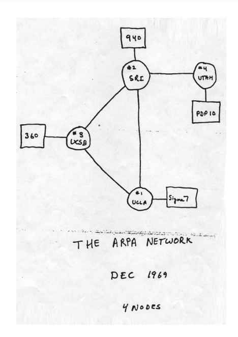

# Visualization of graphs, networks and flows
Version 2.3, May 28, 2024. Compiled by [Mike Peleah](https://www.linkedin.com/in/peleah/). . Comments to the author can be sent to [email](mailto:mike.peleah@gmail.com?subject=Visualization of graphs, networks and flows) or to Telegram [@voodoo_woodpecker](https://t.me/voodoo_woodpecker)

Graphs and networks are all around us, and many things are in constant motion, which can be clearly demonstrated through dynamic visualization. For example, social networks display relationships and communications between people, where each node represents a person, and the connections between nodes represent their interactions. In transportation systems, graphs are used to model the movement of trains, planes, and automobiles, where nodes are stations or airports and edges are routes. In biological systems, graphs help explore networks of interactions between genes, proteins, and cells. Dynamic visualizations of these graphs can show changing connections and flows in real time, allowing you to better understand, analyze and predict the behavior of systems.

# Graphs and networks
## When the graphs were small
Graphs and networks have a [long history](https://en.wikipedia.org/wiki/Graph_theory). Until the 18th century, they were mainly used in the form of trees, such as family trees. Their visualization was dominated by aesthetic function, and the number of nodes and connections was insignificant. In the 18th-19th centuries, graphs began to be actively used as a convenient mathematical apparatus, for example for [the problem of the seven Königsberg bridges](https://en.wikipedia.org/wiki/Seven_Bridges_of_K%C3%B6nigsberg), analysis of electrical circuits, organic molecules, and many other tasks. The number of nodes and connections remained insignificant. To visualize the graphs, schematic images of vertices and connections between them were used; additional parameters were rarely visualized.

[Никитин И. Н. Родословное дерево русских государей, 1731. Коллекция Государственного Русского музея](https://rusmuseumvrm.ru/data/collections/painting/17_19/nikitin_i_rodoslovnoe_derevo_russkih_gosudarey_1731_zh_3/index.php)

## Internets come to town
The Internet began in 1969 with three nodes at UCLA and Stanford Universities, but began to grow very quickly. While in the 1970s, Internet maps could still fit on a piece of paper, [in 2011, an Internet map](http://internet-map.net/) was like a map of the galaxy—fascinating, but impractical. To visualize computer networks, it was important to show the relationships (physical) between nodes and the type of node (hardware used). The movement of packets and the throughput of nodes depended on these parameters—the idea was to ensure guaranteed transmission of packets even if a significant number of nodes were damaged. As visualization of the entire Internet has become quite impractical, the approach has shifted towards visualizing fragments of the network. In this case, only the part is visualized in detail, for example, that which is in the area of ​​responsibility of the administrator or that is directly related to a given node (for example, in routers). In this case, nodes and their types are indicated (most often visualized with standard icons). Such visualizations can be interactive and provide additional information (IP address, status, access to access settings, etc.)

[A sketch of the ARPANET in December 1969. The nodes at UCLA and the Stanford Research Institute (SRI) are among those depicted. Wikimedia Commons](https://en.wikipedia.org/wiki/File:A_sketch_of_the_ARPANET_in_December_1969.png)

[Map of the ARPANET 1973. Wikimedia Commons](https://en.wikipedia.org/wiki/File:Arpanet_map_1973.jpg)

[ARPANET logical map circa 1977. Wikimedia Commons](https://en.wikipedia.org/wiki/File:Arpanet_logical_map,_march_1977.png)

[El-Alfy, El-Sayed & Al-Obeidat, Feras. (2015). Detecting Cyber-Attacks on Wireless Mobile Networks Using Multicriterion Fuzzy Classifier with Genetic Attribute Selection. Mobile Information Systems. 2015. 1-13. 10.1155/2015/585432.](https://www.researchgate.net/publication/282772151_Detecting_Cyber-Attacks_on_Wireless_Mobile_Networks_Using_Multicriterion_Fuzzy_Classifier_with_Genetic_Attribute_Selection)

## Social media
The early 2000s witnessed a boom in social media research. A 2002 article looked at community formation using the example of a karate club ([old study from the 1970s](https://en.m.wikipedia.org/wiki/Zachary%27s_karate_club)) and collaboration networks at the Santa Fe Institute. If in the case of the karate club the number of nodes was only 34, then in other cases - collaboration networks in universities or friendship graphs on Facebook - the number of nodes (and connections between them) grew rapidly, reaching hundreds and even thousands. The visualizations became very complex, turning into huge clouds, beautiful but not very practical. The solution was algorithms that made it possible to group nodes into communities or highlight the most important nodes by the number of connections. Networks processed in this way are easier to visualize - show communities, highlight fragments for detailed visualization, etc.

[Girvan, M., & Newman, M. E. (2002). Community structure in social and biological networks. Proceedings of the National Academy of Sciences of the United States of America, 99(12), 7821–7826](https://doi.org/10.1073/pnas.122653799)

[(a) The friendship network from Zachary's karate club study. Nodes associated with the club administrator's faction are drawn as circles, those associated with the instructor's faction are drawn as squares. (b) Hierarchical tree showing the complete community structure for the network calculated by using the algorithm](https://www.ncbi.nlm.nih.gov/pmc/articles/PMC122977/)

[The largest component of the Santa Fe Institute collaboration network, with the primary divisions detected by algorithm indicated by different vertex shapes](https://www.ncbi.nlm.nih.gov/pmc/articles/PMC122977/)

## Bibliography
A good example of a visualization is provided by [ConnectedPapers](https://www.connectedpapers.com/). It effectively displays part of the network of scientific articles around the selected article, providing high readability and information content. This data-rich chart strikes a balance between information and ease of use. The importance of articles on the web is indicated by the size of the circle based on the number of citations. Color coding is used to display the time of publication, making it easy to distinguish between new and old works. The interactivity of the visualization allows users to obtain additional information when highlighting individual elements, which makes the study more in-depth and detailed. Visualization is flexible, ConnectedPapers allows you to present the same information in different formats - tables or graphs - providing convenience for users with different needs and preferences.

[ConnectedPapers](https://www.connectedpapers.com/main/0b4c513b66754d5e7c700508629e2d28b1061609/graph?utm_source=share_popup&utm_medium=copy_link&utm_campaign=share_graph)

For comparison, a large Web of Science citation graph, visualization by Dávid Deritei & Levente Varga (2015 edition)

[CEU Department of Network & Data Science, twwet Jan 8, 2018](https://x.com/dnds_ceu/status/950390387834785792)

## Trade
Product Space is a network that connects products based on their likelihood of being exported together. This network can be used to predict future exports as countries are more likely to export products related to current exports. In such a diagram, the size of the nodes corresponds to the volume of exports, the colors correspond to the product group, and products with a competitive advantage (RCA, Revealed Comparative Advantage) are highlighted. Details of the methodology are in the article [Hidalgo, C. A. & Hausmann, R. The building blocks of economic complexity. Proc. Natl Acad. Sci. USA 106, 10570–10575 (2009)](https://doi.org/10.1073/pnas.0900943106)

[Observatory of Economic Compelxity, Product Space China, 2022](https://oec.world/en/profile/country/chn)

# Flows
The most commonly used visualization tool is the [Sankey diagram](https://en.wikipedia.org/wiki/Sankey_diagram), originally invented in 1898 to demonstrate the energy efficiency of a steam engine. In this case, the graph elements are constant, and the emphasis is on visualizing the flows between them and the characteristics of these flows, for example, volume, power.

## Material flows
Eurostat uses a Senkei diagram to visualize material flows in the European Union

[Material Flows, European Union - year 2022](https://ec.europa.eu/eurostat/cache/sankey/circular_economy/sankey.html)

## Metabolism of cities
Visualizing urban metabolism using Senkei diagrams allows you to visualize and analyze the flow of resources, energy and waste, which promotes better understanding and can help optimize the sustainability and efficiency of urban systems - for example, identifying leaks and losses of efficiency. Sankey diagrams are important because they show how resources move through different elements of a city's infrastructure, identifying bottlenecks and opportunities for improvement. In these diagrams, flows (arrows) represent the amount and direction of moving resources, energy or waste, which can change depending on time and conditions, while nodes (the main elements of the system, such as factories, residential buildings or transport hubs) remain relatively constant, providing a basis for data analysis and interpretation.

[Urban Metabolism: A Real World Model for Visualizing and Co-Creating Healthy Cities](https://www.thenatureofcities.com/2018/07/24/urban-metabolism-real-world-model-visualizing-co-creating-healthy-cities/)

# Questions for visualization
- How big is the system I am visualizing?
- Do I need all the information at once? Can I simplify it? For example, show only a fragment of the system? Or aggregate some parameters?
- What is important for me to show? Nodes? Types of nodes? Connections between them? Directed or undirected connections? Does the volume of flow / connection matter?
- What is static and what is dynamic? For example, do the nodes themselves change? Connections between nodes?

# Tools
## Standalone packages
[Gephi](https://gephi.org/) is a powerful and convenient tool, “*kind of like Photoshop, but for graphs*,” as the authors themselves put it. An open source package for visualizing and analyzing complex networks and graphs that allows researchers and analysts to efficiently represent and interpret data. The downside is that the resulting visualizations are not very interactive and the package sometimes gets weird.
[Kumu](https://kumu.io/) is a flexible tool for visualizing and analyzing networks and graphs. Allows users to create interactive maps of complex systems and relationships. Gives you the opportunity to choose from several templates for visualization of networks, systems, dynamic or static. The trick is data-based decoration, which allows you to create interactive charts and a variety of diagrams based on one set of data. Can take data from Google.Sheet, which allows you to distribute the “code” and “data” of the diagram 👨‍💻 Requires payment for private projects. Since it is written in JS, it starts to work slowly on 250+ nodes for an interactive diagram.
[cytoscape](https://cytoscape.org/) is a powerful and extensible open source tool for visualizing and analyzing complex networks, especially biological ones, offering rich functionality and integration with many plugins, but can be computationally intensive and more complex interface for novice users. Has the ability to program in JS 👨‍💻, see [cytoscape.js](https://js.cytoscape.org/). [PubMed Central](https://www.ncbi.nlm.nih.gov/pmc/?term=(cytoscape+AND+network)&report=imagesdocsum&dispmax=100) you can find many examples of cytoscape visualization

## Packages for Python
[Plotly](https://plotly.com//) can draw both [networks](https://plotly.com/python/network-graphs/) and [Senkei diagram](https://plotly.com/ python/sankey-diagram/)
[cytoscape.js](https://js.cytoscape.org/) is a powerful JavaScript library for visualizing and analyzing graphs in web applications, offering high performance and customization flexibility, but can require significant initial setup effort and integration into complex projects. There is an adaptation for R, [RCyjs](https://www.bioconductor.org/packages/release/bioc/html/RCyjs.html)

